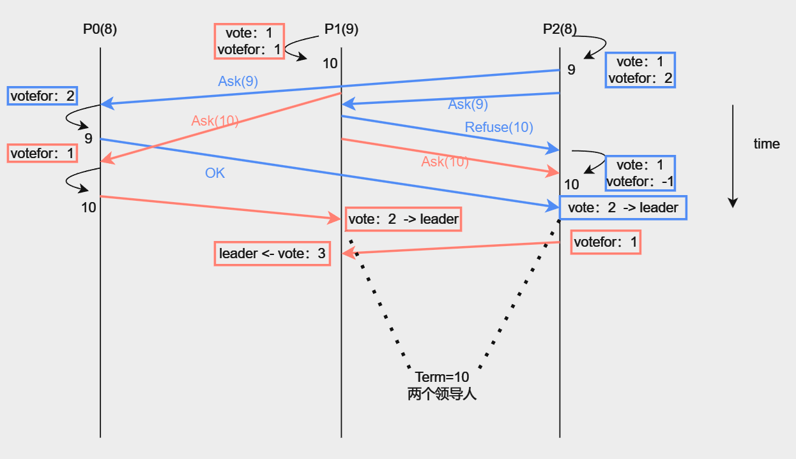

# 3A 

大概完成于5月12日到5月15日

实验完成记录于7月15日撰写

# Interface: API for k/v server

实际应用中, *raft*以*lib*的形式存在, 假设我们使用的是*k/v server*, 那么每个服务将有两部分代码组成:**应用程序代码和Raft库**(见lec课上画的图), 因此*raft lib*需要提供接口给应用程序:

1. `Make(...)`: 创建一个新的*Raft*服务器
2. `Start(...)`: 应用程序告诉*raft*记录一个*log*
3. `applyCh <- ApplyMsg`: *raft*需要告诉应用程序该*log*已写好了(同时还需要通知其他*followers*)
4. `GetState()`: 询问当前*term*, 以及该服务器是不是*leader*

***1.Make()***

```go
// peers      []*labrpc.ClientEnd
// me         int
// persister  *Persister
// applyCh    chan ApplyMsg

func Make(peers, me, persister, applyCh) *Raft {
	rf := &Raft{}
    ....
	return rf
}
```

应用程序将所有*raft server*的网络标识符`peers`告诉新建的服务器, 每个*raft*都保留该状态以便互相通信; `peers[me]`则是该服务器对应的标识符; `persister`告诉服务器应该把需要持久化的状态存放在哪儿; `applyCh`则提供了服务器向应用程序发送*ApplyMsg*的通道, 前面也提到了是为了通知应用程序写日志结束.

***2.Start()***

```go
// command   interface{}

func (rf *Raft) Start(command) (int, int, bool) {
    ....
	return index, term, isLeader
}
```

应用程序将要追加到日志的命令`command`发送给服务器, 返回该命令在日志中存放的位置以及当前的任期号和该服务器是否为*leader*

# Leader election

以下是一个关于我的设计的总览

- **涉及到的服务器状态**: *leader*, *candidate*(实际中未使用), *follower*
- **超参数**: 心跳间隔: *heartTime int*, 选举超时: *upper int64*, *length int64*
- **涉及的RPCs(论文中)**: *RequestVote RPC*, *Heartbeat RPC*(原文*AppendEntries RPC*)
- **相关的函数**:
    1. `func (rf *Raft) ElectionGoroutine(upper int64, length int64) {}` 
    2. `func (rf *Raft) HeartBeatGoroutine(heartTime int) {}`
    3. `func (rf *Raft) ElectLauncher() {}`
    4. `func (rf *Raft) HeartBeatLauncher() {}`
    5. `func (rf *Raft) SendRequestVote(to int, args RequestVoteArgs, vote *uint32) {}`
    6. `func (rf *Raft) SendHeartbeat(to int, args AppendEntriesArgs) {}`
    7. `func (rf *Raft) HeartbeatHandler(args *AppendEntriesArgs, reply *AppendEntriesReply) {}`
    8. `func (rf *Raft) RequestVoteHandler(args *RequestVoteArgs, reply *RequestVoteReply) {}`
    9. `func (rf *Raft) SendRPC(to int, rpc string, args interface{}, reply interface{}) bool {}`

心跳和选举事件大致过程是:

- `HeartBeatGoroutine` -> `HeartBeatLauncher` -> `SendHeartbeat` -> `SendRPC` -> `HeartbeatHandler`
- `ElectionGoroutine` -> `ElectLauncher` -> `SendRequestVote` -> `SendRPC` -> `RequestVoteHandler`

(**避免race condition的策略**)将发送rpc的过程如此分割开, 主要是为了避免竞态条件, 事先在`xxxLauncher`中将rpc发送需要的数据提前拷贝一份作为函数参数传入`Sendxxx`, 就可以避免在并行发送rpc的时候不断获取/释放锁.

(**避免deadlock的策略**)在*raft*层, 我只对每个服务器使用了一把锁`rf.mu`.

1. 任何需要等待的事件在开始之前都不允许持有`rf.mu`;
2. 任何函数的注释必须写明调用前后的锁资源持有情况, 类如`调用前不持有rf.mu, 调用后不持有rf.mu`, 在一个函数中调用另一个函数, 或者是额外开一个函数前需要提前阅读改函数注释的锁要求;
3. 对资源的访问比较保守, 只要涉及读/写服务器的资源就提前请求锁

(**接收方处理rpc消息的规范**)任何服务器收到对方的rpc消息时(也就是在`xxxHandler`函数中): 

1. 任期检查, 观察到发送方任期小于自己的时候, 就直接*return*, 并附加自己的任期返回(任何时刻都返回旧的任期). 任何*rpc*的`xxxArgs`和`xxxReply`中必须带有`Term int`以支持任期检查;
2. 任期更新, 如果发送方任期更大, 那么更新自身任期, 此时处理程序结束后必须做持久化, 同时需要将`rf.VotedFor`修改为-1表示当前任期可以投票
3. 定时器重置, 如果接收方服务器"认为"发送方是当前任期下的*leader*, 那么就需要重置定时器, 在我的设计中是`rf.LastRPC = time.Now()`, "认为"不代表对方一定是当前任期下的*leader*, 这一点在`RequestVoteHandler`中体现为只要投票给了对方, 那么就可以重置自身定时器.

---

# 过程问题记录

## 1. ***如果候选人得到了一个任期比自己新的回复, 那么如何处理当前自己发起的选举?***

由于我的设计中, `args.Term`是在`ElectLauncher`中构造的, 在`SendRequestVote`中使用的只是该旧值, 所以如果在此期间候选人自身的任期**被更新**, 对已经发起的选举, 我们是无法主动停止. 如果我们不对该情况做任何处理, 那么这个候选人会错误地成为*leader*, 但同时又具有最新的任期---这导致当选*leader*后发起的心跳宣言附带的任期是最新的.

一句话, **发起选举的任期号和发送心跳消息的任期号不一致**, 这很明显是不符合要求的, 所以我们必须规避在这种情况下该候选人成为领导人, 所以在`SendRequestVote`中我们需要拒绝该投票的回复:

```go
rf.mu.Lock()
if rf.CurrentTerm != args.Term {
	rf.State = FOLLOWER
	rf.mu.Unlock()
	return
}
```

实际上, 所有`Sendxxx`函数中都需要处理`rf.CurrentTerm!=args.Term`的情况, 在助教的指导中这种情况被视为**过期的rpc回复**


## 2. ***如何处理"其他候选人获胜"这一事件?***

由于**大多数原则**, 如果说当下任期有其他服务器成功得到超过半数投票, 那么作为落选的服务器, 是不可能再得到超过半数的投票, 所以不需要做任何处理.


## 3. ***如何理解当 votedFor == candidateID 时同意投票? (更有趣的是保持了rpc幂等)***

这个问题源于我在实现过程中对`rf.VotedFor`这个*metadata*存在性的疑惑, 先来解决该问题.

因为网络故障的问题, 会出现同一轮选举中候选人多次向服务器请求投票, 而该服务器却投过票给候选人的情况. 比如返回的rpc消息丢失, rpc消息延迟导致候选人端超时重发等等, 为了使服务器返回相同的结果, 我们需要囊括这种情况, 即`votedFor == candidateID`

***新的问题产生了, 幂等性如何?***

```
在这之前先纠正一下幂等性的定义, 幂等要求: 用户对于同一操作发起的一次请求或者多次请求的结果是一致的
```

对于前面提到的第一种网络故障: rpc消息丢失, 我想该rpc依旧保持了幂等性, 候选人未收到该投票请求的回复, 所以得票数并未增加, 等待超时后重新向该服务器请求投票, 依旧得到`reply.VoteGranted == True`同意投票的返回. 但若是因为rpc消息延迟导致的重发, **现有的实现是不能处理重复收到投票结果**.

假设由于响应rpc消息的延迟返回, 和第二条投票请求的响应消息一同到达候选人端, 那么候选人会记录两次得票, 这打破了*raft*对投票的要求: 给定一个任期下, 一个服务器只允许投一张票. 

该问题移步到[是否需要处理重复的RequestVote返回](my%20Raft.md)

然后看一个有意思的分析 [投票的任期检查是否需要包含args.Term == rf.CurrentTerm](https://github.com/sofastack/sofa-jraft/discussions/950)

得到的结论是将`if args.Term >= rf.CurrentTerm`的要求放宽到`if args.Term > rf.CurrentTerm`是不会影响*raft*的正确性, 但是前者可以加快选举

# hint内容

1. 关于心跳消息频率的要求, *hints*里说明了每秒不超过10次
2. 测试要求5秒内必须选出新的*leader*
3. 论文中提到的选举超时设置为`150~300ms`, 这只适合心跳频率远远大于`150ms/times`, 比如`10ms/times`才合适, 由于测试限制了每秒的心跳次数, 所以需要仔细设置超时时间.
4. lec里Morris提到了, 选举超时的下限最好是心跳周期的倍数, 上限取决于需要多高的性能, 另外一个问题是不同节点选举定时器的超时时间差要足够长, 至少要大于完成一轮选举的时间, 最少就是发送一条RPC的往返时间.

# Some Bug

1. 第一个遇到的问题是由于只关注leader的任期过期更新, 忽略了让follower收到更新的任期后也更新.

这个问题比较好解决, 严格按照原则`每轮rpc, 发送和回复都附带任期, 更新较小服务器的任期且设置状态为FOLLOWER`即可避免这样的犯错

2. `multiple elections test`出现多个leader, 出现在lab3完成后第一次`1999/2000`测试的日志中

```log
Test (3A): multiple elections ...
080188  [VOTE-1] p2(F,1): Vote Start
...
080193  [VOTE-1] p2(L,1): Got 7 votes
disconnect(5)
disconnect(3)
disconnect(2)
081596  [VOTE-7] p1(F,7): Vote Start
081596  [VOTE-7] p1(F,7)->p0 "Ask Vote"
...
084704  [VOTE-2] p4(F,2): Vote Start
...
084710  [VOTE-2] p4(F,2): Got 4 votes
.
.
126402  [VOTE-8] p0(F,8): Vote Start  "这里p0和p3都是断开集群的状态"
127173  [VOTE-9] p3(F,9): Vote Start
connect(0)
connect(1)
connect(3)
---------所有服务器已均连上来----------
132272  [VOTE-9] p6(F,9): Vote Start
132272  [VOTE-10] p3(F,10): Vote Start
132272  [VOTE-9] p6(F,9): Got 4 votes    "为什么就得4票了???"
132272  [VOTE-9] p3(F,10)->p6 "Refuse Vote"
...
132272  [VOTE-10] p3(L,10): Got 7 votes
--- FAIL: TestManyElections3A (5.62s)
    config.go:447: term 10 has 2 (>1) leaders
```

后面的情况看不出来有什么问题, 看日志的时候发现了上面这种情况, 没有找到原因, `p1(F,7)`哪儿冒出来的也不清楚, 有可能是打日志的时候没有排除竞态条件导致的, 可以看到`p6`在任期数为9的时候就得到了4票.

我大概猜测了一下, `p6`在任期9的时候发起了一轮选举, 然后获得了足够的票, 同时`p3`在任期10发起了一轮选举, 然后这里发生了前面**过程问题记录**第一个谈到的问题, `p6`成为领导人之前收到了`p3`的`Refuse Vote`, 更新自己的任期号为10, 其余服务器在任期9和任期10都同意投给了`p3`和`p6`, 但是`p3`和`p6`的领导人身份都保留到了任期10, 也就导致了任期10有两个领导人

为了方便分析, 来看一个小一些的例子: 



目前来看的解决方案:
1. 我们使用`CANDIDATE`状态, 当`p2`在任期9发起选举的时候, 从`FOLLOWER->CANDIDATE`, 然后`p2`想要当选领导人, 除了获取过半投票以外, 还必须处于`CANDIDATE`状态
2. `p2`想要成为领导人, 除了获取过半投票, 同时需要`rf.VotedFor == rf.me`, 这得益于我们之前的规范: 对rpc的处理, 如果更新了自身任期, 那么修改`rf.VotedFor = -1`
3. 究其本源, 会出现`p1(9)`这种情况是因为服务器`p1`之前和集群断开连接自身不停增长任期导致的, 如果我们实现了`PreVote`那么就不会出现重连上来的服务器任期更高的问题.


---

# 测试

**python dtest.py -n 10 -p 5 -s -v 3A** 使用助教写的脚本测试

- `--sequential -s`：按顺序运行每个组的所有测试
- `--workers -p INTEGER`：并行任务的数量，默认为1
- `--iter -n INTEGER`：要运行的迭代次数，默认为10
- `--verbose -v INTEGER`：详细程度，默认为0
- `--archive -a`：保存所有日志，而不仅仅是失败的日志
- `--race -r --no-race -R`：使用竞态检查器运行，默认为no-race
- `--loop -l`：连续运行
- `--growth -g INTEGER`：使用`--loop`时迭代的增长比率，默认为10
- `--timing -t`：报告计时，只在macOS上工作
- `--help`：显示此消息并退出