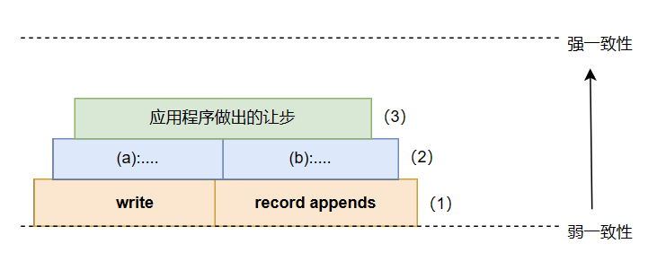
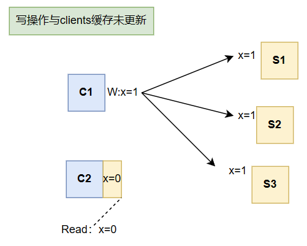
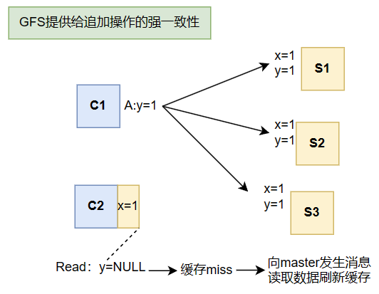

# The Google File System

***杂谈***

虽然论文中提到对以往在分布式文件系统设计领域中的一些假设, 观点之类的, 怎么样怎么样, 但是这篇论文对笔者来说是分布式文件系统的第一篇, 所以"旧时代"老旧的错误观点和假设我并不清楚, 毕竟, 即使是GFS这篇文章, 也是许多年前了的, 所以对于涉及到以前的设计错误之类, 笔者只能找到一个让自己觉得能认可的理由, 不会过深入地去了解.

## Abstract

这篇文章的成果: `GFS`, 文章的架构:

1. **接口**
2. **设计**
3. **性能**

我们能够从"接口"的内容中看见传统的文件系统扩展到支持分布式的文件系统的变化;

"设计"的内容则展示了接口的实现;

从这篇文章开始,我决定拾起以往忽略的文章中性能报告一部分,为了优化自己一直以来阅读论文的方式, 我会重新评判一下这是否有必要精读.

## Keywords

容错, 扩展性(兼容), 数据存储, 集群存储.

## Introduction

**Motivation:** 对数据处理的需求, 尤其是规模快速增长的数据.

**GFS**保持了传统分布式文件系统的要求: `性能`, `扩展性`, `可靠`, `可用`, 同时由于谷歌这种体量的公司对庞大的数据和计算集群有更多的机会观察, 所以对分布式文件系统有一些过时的假设, GFS不一样的地方就在这些方面.

1. *故障是常态*
2. *文件非常大*
3. *追加比修改更频繁*
4. *共同设计应用程序和文件系统API是有益的*

因此我们需要有一些应对的方案:

1. `持续监控`, `错误检测`, `容错`, `自动恢复`这些功能是必不可少的.
2. 需要重新设定一些`参数`(以往没有想象过文件会如此庞大).
3. 优化`追加操作`的性能, 保证追加操作的`原子性`是重点工作, `客户机中缓存文件内容`则变得没那么有吸引力.
4. 针对应用程序或者说工作负载来设计文件系统的接口, (当然)能极大提高特定负载下的文件系统性能.

我需要对第三点做补充, 由于工作负载的特点, 随机写入和覆盖数据没那么频繁, 而且读写的文件也非常庞大, 这意味着客户端读取了一部分数据很有可能不再读取, 那缓存的优势就没有那么大, 文件系统也不必为了缓存的一致性而增加更多复杂性, 我们可以把目光聚焦于如何让追加数据更快即可.

## Design

### Assumptions

1. *机器假设* : 故障是常态.
2. *文件大小假设* : 几百万个文件中, Multi-GB文件很常见, 尽管小文件也有,但是不必专门为它们进行优化.
3. *工作负载假设* :
   - 大的流式读取;
   - 小的随机读取;
   - 大的,顺序的追加写入,写入后很少再修改;
4. 多个客户端会同时追加同一个文件.
5. 应用程序大多重视高速批量处理数据, 对单个数据写入或读取的响应时间没有严格要求---高持续带宽 > 低延迟

笔者网络没怎么学, 单独解释一下**高持续带宽**, 描述的是数据传输的速度, 高带宽意味着可以在单位时间内传输更多的数据, 而**低延迟**指的是对一个数据的访问从发出申请到返回数据的间隔时间很小

### GFS's interfaces

常规的: `create`, `delete`, `open`, `close`, `read`, `write`
GFS特别提供: `snapshot`(快照), `record append`(追加记录)

具体细节在后续再说明.

### 架构

### chunk size

在当时, GFS设置的大小为64MB, 这对当时来说是一个比较大的数字,超过了大多数文件系统的块大小.

***Advantage***

1. 有效减小*clients*与*master*的交互次数;
2. 每个数据块信息更多, 与持久*TCP*搭配起来减少*TPC*连接的建立和关闭次数;
3. 追踪数据块所需的数据结构减少了, 从而*metadata*的大小变小, 这使得*master*可以将*metadata*保存在内存中, 这带来了另外的优势(见后文).

***Disadvantage***

对一个固定大小的文件来说, 较大的*size*意味着其数据将存储到更少的*chunkservers*上. 

如果文件被*clients*频繁地访问, 将导致一些*chunkservers*成为**hot spots** --- 即这些服务器将承受很大的负载.

让我举一个例子来说明一下: 

```
假设有1k个client访问文件A, 文件A的大小等于chunksize*chunknums Bytes, 每个chunkserver存储xxBytes,

1. chunksize = 64MB    chunknums = 1024  ServerNum = 16(假设分散存储)   AverAccessNum 62.5(63)
2. chunksize = 1024MB  chunknums = 64    ServerNum = 1                 AverAceessNum 1000
```

### Metadata

1. *file*和*chunk*的命名空间
2. *file-to-chunk*的映射信息
3. *chunk*副本的位置

对于前两种*metadata*, *master*采用持久化(写日志)的方式保存, 而每个*chunk*副本的位置, 则没有采取持久化的方式, 理由如下:

- 对于*chunk*保留在哪个*chunk server*, 这一信息GFS是动态获取的, 即当*master*重启或者有新的服务器加入集群时, *master*会询问服务器关于*chunk*副本的位置并保存该信息, 然后通过定时的心跳消息来监控服务器的状态.
- 如果我们想要持久化保存块位置信息, 那我们需要额外且大量的工作,去同步*chunkservers*与*master*的信息.
- 论文中提到的另一个理解方式: *chunkserver*对其磁盘上有哪些块有最终的决定权, 在*master*中保持一致视图是无意义的.

### Operation Log

操作日志: *master*会把对元数据的修改操作记录在其中, master用此来实现持久化的存储以及定义并行操作的具体逻辑顺序. 比如多个clients同时对一个文件进行追加操作, 究竟是哪一个先执行在日志中有明确的记录.

这部分日志内容除了存储在master本地磁盘中外,还会备份到多个远程机器上, 大部分写日志的优化都和操作系统中见过的相似, 比如批处理等等.

***对日志大小的限制***

这一限制的动机是为了避免重启*master*的重放操作的时间过长.

*operation log*和*checkpoint*技术搭配起来使用:当日志大小超过一定限制的时候, *master*就会进行加检查点, 然后清空日志的内容, 以便进行后续的操作记录, 一个简单的例子如下:

```
limit size---+----------+--------------
            -+         -+        .....
log size: -  .       -  .       - 
        -    .     -    .     -
      -      .   -      .   - 
    -        ↓ -        ↓-
time:--------+----------+-------------->
             A          B
        checkpoint  checkpoint
```


**值得注意的是**, 在上图`A`, `B`创建检查点的时候, 论文中提到对于拥有几百万个文件的集群来说, 这个时间开销在一分钟左右.

为了不阻塞这段时间内修改*metadata*的操作, 这个时候*master*会切换到新的日志文件, 然后在一个单独的线程中来进行创建检查点(意味着`A`, `B`时刻会有切换线程的操作)

设想我们在A~B之间某个时间点t1崩溃了, 那么我们可以按照**加载检查点A->重新执行[A~t1]内的操作**来恢复master的状态.

---
***小插曲: 2024/5/9***

这篇论文阅读搁浅了有一些久,中途重新阅读了一次笔记后去玩了两天游戏, **chaos;child**, 真好玩啊, 士力架我的超人!

如果这个月能完成lab3那六月份就奖励玩几天, 主要想打通每个线吧, 加油!

---

### 一致性模型

***写在前面的***

初读论文的时候我感觉到困惑, 因为我下意识的认为"绝对的透明"和"强一致性"是一个存储系统默认的特性.

在这篇论文对应的视频中, Robert教授解开了我的疑惑和不适感, Google的目标是构建一个大的, 快速的文件系统, 也就是*GFS*, *GFS*并不面向普通的用户, 这是一个Google内部使用的系统, 给内部工程师写应用程序使用的, 所以应用层对存储层具有一定的知识也就不足为奇, 其次*GFS*在各个方面对大型的顺序文件读写做了定制优化, 这意味着*GFS*是为了大型文件与性能而生.

阅读整篇论文后, 我是这么看待*GFS*的: 
- 对于大型文件采用追加操作, *GFS*提供了如同强一致性模型的保障;
- 其他情况采用随机读写, 此时*GFS*则视为弱一致性模型, 并不能保证返回正确的数据.

为此, *GFS*利用了很多技巧和假设来达到这一目的, 对追加操作有一致性保障的同时不损失太多性能



**(1)** 对数据的修改操作有两种: *对已有数据的重写*; *追加数据*

**(2)** *GFS*保证了`(a)`对数据的每个副本修改顺序一致, 以及`(b)`使用*chunk*版本号

**(3)** 使用*GFS*系统编写应用程序的人会在应用层做出一些让步:
  1. 依赖追加操作
  2. *checkpoints*
  3. *self-validating*
  4. *self-identifying*

我们以两个客户端`C1`,`C2`, 三个服务器`S1`,`S2`,`S3`为例子, 看看*GFS*是如何提供的一致性保障:





## SYS Ineractions

### Lease

为了尽可能减少*master*机器的工作(因为GFS只设置了一个*master*), *GFS*引入了*Lease*(租约)机制, 前面我们提到*GFS*保证了对数据的每个副本修改顺序一致, *master*会选择一个副本授予一个租约, 称其为**primary主副本**, 主副本会为所有修改确定一个执行顺序, 其他副本都会按此顺序进行.

在论文的*Figure2* , 演示了在引入租约机制后, *GFS*是如何读写数据, 介于论文中写的十分清晰, 这里仅仅简单的翻译一下以便后日回顾:

**控制流与数据流图示的步骤**

1. ..
2. ..
3. ..
4. ..
5. ..
6. ..
7. ..

### Record Append

重点还是想记录*GFS*的*append*操作, 毕竟*GFS*是服务于大型文件, 而使用最多的操作就是*append*操作.

第一个观点是:**并行的传统写操作无法序列化**, 考虑到传统写操作会指定被写数据的偏移量, 假设并行以下写操作:

```c
// 传统写操作
void *write_to_file(void *arg) {
    FILE *file = fopen("file.txt", "r+");
    fseek(file, 10, SEEK_SET);
    const char *data = (char *)arg;
    fwrite(data, sizeof(char), strlen(data), file);
    fclose(file);
    return NULL;
}

// 并行执行多个写操作
pthread_create(&thread1, NULL, write_to_file, "Makise\n");
pthread_create(&thread2, NULL, write_to_file, "Kurisu\n");
```

像上面这些并行执行写操作的话, 极大的可能你无法看到一个完整的单词(要么是`Kurisu`要么是`Makise`), 而是交错的一些英文字母.而*GFS*中的记录追加操作, 我们仅仅告诉文件系统想要追加的内容: `Kurisu`和`Makise`, 然后交由*GFS*执行以下流程:

1. *client*将追加的数据发送到该文件使用数据块的最后一个的所有副本中
2. *client*向*primary*发送追加请求
3. *primary*接收请求, 检查追加的数据是否导致数据块超过最大值, 如果超过, 则让副本都填充该数据块, 然后返回一个信息给*client*: 对下一个数据块重做该操作(这里应该是"用掉"了一些追加的数据的)
4. 重复**1**-**3**,直到当前数据块足够存储当前追加的数据, *primary*通知所有副本将数据追加到其中, 然后向*client*返回成功, 并告诉其被追加数据的确切偏移量

***append对错误的处理***

*GFS*会重试在任何副本上失败的追加操作, 但这并不保证每个数据的任何副本都是一致的, 原因有很多, 使不同副本的数据不被保证在同一时间点达到一致状态, 不过这在*GFS*的容忍程度之内.

换句话说, *GFS*只是保证了会对所有副本进行相同的追加操作, 但是并不提供字节级别的一致性保证.

---

搁置一下WRITES操作, 对以下内容熟悉以后再来构建其流程图:

1. chunk版本号
2. primary与secondary机制

---

## Master

让我们把目光放在*master*上, 看看*GFS*在*master*对下面这些内容是如何管理的:

1. *file namespace*
2. *chunk&replica*的创建与管理
3. *file*与*chunk*的删除
4. (单独提出) *chunk version number*

### file namespace

**关键词:** `lookup table`, `R-W lock`

*GFS*没有像传统的*fs*那样通过`目录`+`普通文件`的方式维护文件, 而是采取的维护一个映射表, 其表项内容为: `<绝对路径,元数据>`来管理文件: 

```
lookup table(查找表): 
foo       ········-> inode + R-Wlock
foo/bar   ········-> inode + R-Wlock
foo/bar/a ········-> inode + R-Wlock
foo/b     ········-> inode + R-Wlock
...
```

以在`foo/bar/a`中写入或修改数据为例, *GFS*会按顺序获取这些读锁: `foo`->`foo/bar`, 然后获取`foo/bar/a`的写锁, 严格按照*namespace tree*的顺序来获取读写锁不仅可以避免死锁, 还能保证当修改文件`a`的内容时其路径结构不被破坏.

由于论文中提到了,这里还是写上: 因为锁也是一个内存资源的消耗, 所以这些读写锁的创建是惰性的, 不被使用时就会销毁

### Chunk&Replica

**关键词:** `chunk创建`, `replica分配策略`

前面我们有提到`hot spots`的问题, 同时在当时(2003年)网络带宽是一个稀缺的资源, 所以论文设计时候的那代*GFS*会尽可能满足以下这些期望:  *chunk*副本分布均匀, 最大化网络带宽, 保证多份数据能互相提高容错(放置在不同机器不同机架上), 所以会有如下的放置新chunk的副本策略:

1. 放置在磁盘使用率较低的*Chunk server*中
2. 放置在"较新副本"数量更少的*Chunk server*中
3. 放置在不同机器不同机架上

这里需要对第二个策略做一点说明: 新建*chunk*通常意味着将会有大量的写操作, 因为*chunk*大多是在写请求时创建的, 放置在新建*chunk*副本比较少的服务器中能均摊一个大文件写请求到多个服务器上, 降低块服务器承担的负载.

论文还涉及到其他内容:

1. 以下情景下我们需要添加副本: "*master*发现某个*chunk*拥有的副本数量低于用户指定的数量", 这通常是由块服务器崩溃, 创建时发生故障, 以及用户手动提高每个chunk副本数量导致的, 对这些需要添加副本(或者论文里的话:重备份)的*chunk*, 同样也有一个优先级别, 这里不再列举.

2. *master*为了均衡磁盘利用率和负载会周期性的检查*chunk*及其副本在*servers*中的分布情况并进行调整.

### 删除

**关键词:** `惰性删除`, `chunk ref`

*GFS*的文件删除不是立刻生效的, 也就是说对用户的误删操作有一定的容忍度, 具体来说会将删除的文件记录上删除时的时间, 把其标记为"已删除文件" (论文里说重命名为一个隐藏的文件名, 不过我想可以额外创建一个表来记录这些"已删除文件"), 等待超过一定的时间后被master彻底删除.

像*xv6*, *linux*中的文件系统对block所做的那样, *master*会为每个*chunk*记录一个*ref*, 也就是引用次数, 当其对应的文件被删除后就会减1, *master*会将*ref*为0的*chunk*从内存中删除(删除的是管理*chunk*的元数据), 并在心跳通信中告诉块服务器, 块服务器再删除掉其数据. 这样设计的*chunk*删除机制同样是为了减少*master*参与操作的数量.

### chunk版本号

我将这一内容单独列出, 是因为这是前面提到的为了保证一致性引入的技术.

主机会在选举主副本的时候更新其块版本号, 然后通知正常运行且块可用的副本进行更新, 这样当那些故障的块服务器重新启动后, *master*会注意到它有一些过时的副本.

如果是*master*因故障重启发现自己记录的版本号比块服务器记录的更低, 那*master*会更新自己的版本号为块服务器记录的.

---
**个人疑惑**
我的疑问根源是版本号的更新是随主副本的选举而不是随写操作, 这是否会导致"确认版本号是否一样来保证一致性"这句话错误 

---
