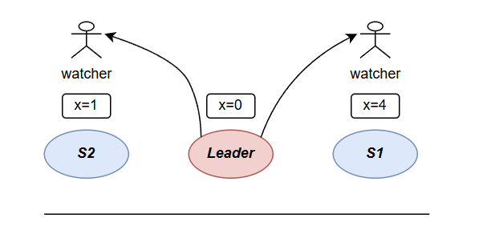
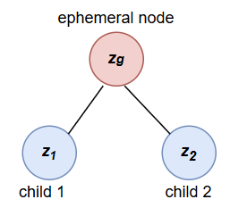

# ZooKeeper

## Linearizability

在这之前有必要再来复习一下关于**正确**的定义, 尽管在`6.5840`的新版课程中提前安排了[Linearizability](https://anishathalye.com/testing-distributed-systems-for-linearizability/)这部分的阅读, 不过现在已经有一些遗忘.

一个系统的执行历史, 或一系列来自客户端的请求, 我们定义**请求(执行)序列**为`能够反应这些请求的执行顺序的逻辑排列`, 如果我们能够在下述**规定**下找到满足下述**条件**的一个序列, 那么我们说这个系统处理这批客户端的结果是**线性的**. 注意, 这一属性并不是说某个系统.

在给出具体的**规定**和**条件**前, 让我们来定义一个最基本的**客户端请求**, 例子中的一个操作:`|-----W(x=1)------|`, 第一个`|`表示客户端在此刻发送了一个请求给系统, 第二个`|`表示客户端收到来自系统的回复, `W(x=1)`表示这次请求客户端希望系统修改变量`x`的值为`1`.

**规定:** 在同一个逻辑时间下, 如果两个客户端请求没有交集(即两个`|`完全分离), 那么在序列中, 这两次操作必须严格遵守逻辑时间执行

**条件:** 按照序列执行后, 每个读请求得到的结果均来自前面最近的一次写请求.

---

我们可以在上述可视化的若干个**客户端请求**中绘出一个**执行序列**, 即通过将`|`和`|`标上有向箭头的方式来表述先执行与后执行的请求, 如果最终得到的是一个带环的图才能满足**条件**, 那么说请求历史不是线性的.

前面的几个例子都是比较朴素, 在上面提到的阅读材料中也见过的, 所以这里不再贴出来了;  然而当我们考虑了各种各样的故障, 使客户端不得不重发请求的时候, 就有一点不一样了, 考虑这个例子:

```
C1: |----W(x=3)----|    |----W(x=4)----|

C2                    |--R(x)--??

case1:                |--R(x)--|re----------------|
case2:                |--R(x)----=-------|re------|
```

如果因为各种各样的问题导致*C2*发出的读*x*请求丢失, 那么它会重发这个读请求, 这个时候我们不得不考虑*C2*收到的回复应该是多少?

这取决于*C2*重发这条读请求的时机, 如果是`case1`, 这个时候`W(x=4)`还未在系统上执行, *C2*快速的重发了`R(x)`, 那么系统会答复`x=3`, 也就是上次写操作的值;  如果是`case2`, 由于*C2*设置的超时时间比较久, 重发`R(x)`比较迟, 现在系统已经收到`W(x=4)`的请求并执行了它, 那么返回给*C2*的值就是4.

不管这里*C2*收到的值是3还是4, 站在系统的视角下, 你可能会说`噢! 请求传到我这里的时间就是这样的, 所以这两个情况下这段序列都是线性的`, 但是站在客户端*C2*的角度, 客户端只知道自己在第一个`|`的时刻发送了读请求, 那么理所应当得到的值就应该是3.

我们根据写过的实验展开来讲讲返回值是3or4, 这其实涉及到的是重发机制是如何实现, 以及是什么原因导致的重发.

1. 如果发送给系统的*rpc*丢失, 那么系统只能无奈地返回4给客户端.
2. 如果是系统返回给客户端的*rpc*丢失, 那么系统可能会设计得来记录这次请求的返回值, 然后如果再次收到该请求, 就发送记录的值, 那么就是3, 这也是我们在*k/v server*实验里为了保证幂等性做的操作

## LEC notes

1. `[53:00]` zookeeper is not a strict ReadWrite system, there are actually writes that imply reads also, and for those sort of mixed writes those those you know any any operation that modifies the state is linearizable with respect to all other operations that modify the state.

例如,一个客户端可能需要先读取某个znode的值,然后基于这个值来更新一个znode, 所以*zk*提供的第一个保证: `all requests that update the state of ZooKeeper are serializable and respect precedence`, 不是说写操作是线性化的, 而是: **任何修改状态的操作都是线性化的**  (这里论文里用词很准确*update*而不是*write*, 只是自己读的时候传成了写操作)

2. `[53:00]` ...and furthermore, that the successive reads have to observe points that don't go backwards that is if a client issues one read and then another read and the first read executes at this point in the log, the second read is that you know allowed to execute it the same or later points in the log but not allowed to see a previous state by issue one read and then another read, the second read has to see a state that's at least as up-to-data as the first state ... and where this is especialy exciting is that if the client is talkinguto one replica for a while and it issues some reads suppose issue read here, if the replica fails, and the client needs to start sendling its read to another replica, that guaranteed this FIFO client order a guarantee still holds if the client switches to a new replica.

对于读操作, 虽说*zk*没有提供线性化的保障, 但是对单个*client*来说, *zk*保障了其看到的数据在逻辑时钟**zxid**这层意义上是单调递增的, 也就是保证不会使用更旧的值. 这一点在以下这个场景的时候比较突出:

```
client     read
zxid         ↓
S1: 1  2  3  4  5
S2: 1  2  3  /  /
                ↑
              read
```

假设客户端发出了两个`read`请求, 在*zk*中, 来自客户端的读请求直接发往*follower*, 假设`S1`收到该读取请求, 返回`zxid=4`的数据给客户端, 然后在`S1`收到第二个`read`请求之前, `S1`挂掉了, 这个时候该请求被发往了`S2`, 那么该读取请求会附带上一次指令的逻辑时间*zxid*(=4), 因此在`S2`中, 可能会等待逻辑时钟增加到4或5才响应这个读请求.

当然也有可能将读请求发给其他服务器尝试, 或者S2看到了这个时间上比自己新的请求, 会请求`leader`同步自己到最新的状态

## (2.4)Examples of primitives

因为学习的时候见过最多的对*zk*的描述就是其提供了一些*API*用于构建同步原语, 所以我们不得不来具体看看这些同步原语利用了*zk*的哪些内容来构建.

### Configuration Management

使用*zk*构建的是一个动态的配置信息管理机制, 这里最主要利用了*zk*的*watch机制*(监视机制), 我们具体来看看, 同时解释一下论文提到的例子.



假设服务器*S1*和*S2*的一个系统配置`x`, *leader*通过监视进程, 当我们想要修改*S1(2)*的系统配置`x`的值的时候, 监视进程就会通知*leader*重新获取其配置`x`.

猜测这个机制是通过*leader*为每个服务器创建一个额外的线程(进程), 当我们对某个*znode*设置监视的时候, 就设置标记`watch flag`, 一个初始的状态就是, *S1*的`x=4, watchFlag=true`, 监视线程定期检查该`watchFlag`,  某个时刻我们修改`x=5`, 那么我们会设置`watchFlag=false`, 然后监视线程发现后就会通知*leader*重新读取*S1*的该*znode*的数据;

论文中提到的例子也就是说, 在修改`x=5`, 设置`watchFlag=false`后, *watcher*通知*leader*, *leader*重新读取*S1*这里的*znode*这个时间段内, 我们反复修改`x=3`->`x=2`->....->`x=7`, 监视线程都不会再观察到, 放在我们的实验中, 就是不会多次向*leader*发送*RPC*------因为现在*watcher*告诉*leader*的事情就是, "`S1`的配置信息被更新了, 现在你持有的数据是旧的, 需要重新读取". *leader*重新读到*S1*的配置信息后, 我们可以以发送*RPC*消息的方式, 将记录*S1*配置信息的*znode*设置为`watchFlag=true`, 然后监视线程重新定期检查`watchFlag`.

### Rendezvous

```
Sometimes in distributed systems, it is not always clear a priori what the final system configuration will look like.
```

这里的场景是客户端想要创建一个*master-workers*的集群, 但是在创建之前我们不知道*master*的任何信息, 比如其地址和端口, 所以我们就需要一种运行时动态获取和更新配置信息的方案(这一点和`Configuration Management`类似)

客户端通过创建一个`rendezvous znode`, 刚开始我们只告诉创建的*master*和*workers*该*znode*的完整路径以便其更新或获取该节点的信息, 当*master*启动的时候, 就会把自己的信息更新到该*znode*中, 当*worker*启动的时候, 它们会对该*znode*设置监控线程, 如果这个时候*master*没有被创建, 那么就会等待监控线程发送消息.

对客户端, 我们还可以提供*ephemeral node*(临时节点)的选项, 这使得当完成其指定的任务后, *master*和*worker*可以通过监控线程观察到该*znode*被删除, 从而结束自己.

### Group Membership

我们利用*ephemeral node*(临时节点)来实现组成员管理的原语



如上图所示, 我们创建一个临时节点 $z_{g}$ 来表示一个组, 在该节点下我们创建了两个儿子节点 $z_{1}$ 和 $z_{2}$ 这代表了两个子进程. 

我们可以使用其唯一的标签作为节点名称, 比如进程ID之类的, 如果没有的话, 也可以在创建该节点的时候加上*SEQUENTIAL flag*让**zk*为其分配一个唯一的标识符.

### Locks

注意, 这里实现的是**分布式锁**, 相比单机提供的锁机制大多是基于硬件提供的原子操作, 这里的分布式系统基于*zk*提供的关于*znode*的操作实现分布式锁.

1. **Simple Locks**

`The lock is represented by a znode. To acquire a lock, a client tries to create the designated znode with the ephemeral flag`, 这句话我们可以看出, 锁资源同样是以一个唯一标识的*znode*的形式实现, 获取锁以创建唯一标识的*znode*的形式呈现, 而等待锁则是通过*watcher*实现, 通过观察*znode*的删除来通知客户端锁资源空闲.

2. **Simple Locks without Herd Effect**

上面提供锁的简单实现方案存在一个**羊群问题**, 只有一把锁,而存在多个客户端在等待的时, 当锁被释放, *watchers*会观察到*znode*被删除, 发送大量的网络通信, 其中大多数都是无效的, 因为最终也只会有一个客户端拿到锁.

这里其实看一下论文给的代码就很容易理解(为了方便自己理解, 我做了一些修改让它看起来更易懂)

```c
void Lock(struct znode* n, char* l) {
  // 创建临时且序列化的 znode
  *n = create(l + "/lock-", EPHEMERAL|SEQUENTIAL);
  while (true) {
    struct znode* C = getChildren(l, false);
    if (n is lowest znode in C) {
      exit(n);
    }
    struct znode p = before(C, n); // 获取队列C中在节点n前的节点p
    if (exists(p, true)) {
      wait(); // 等待节点p被删除(调用Unlock)
    }
  }
}

void Unlock(struct znode n) {
  delete(n);
}
```

假设我们提供给客户端一把分布式的锁, 其对应的*znode*路径是*l*, 我们使用`SEQUENTIAL flag`, 当客户端请求锁*l*时, 在该*znode*下序列地创建若干*znode*, 每次只让某一个持有当前序列中最小标号*znode*的客户端返回, 也就是**获得锁**, 可以看到, 这种方式实现的分布式锁, 不仅解决了羊群问题, 同时在出现某些与锁有关的问题, 比如死锁时, 可以通过打印*l*下创建的*znode*序号来查看客户端请求锁的顺序.

3. **Double Barrier**

双屏障是一种`让客户端等待足够多的服务器, 然后同时在这些服务器上启动需要的工作`的同步机制.

利用*zk*提供的机制这其实应该很好实现, 只需要创建一个*znode*表示一个屏障, 加入新的服务器就创建一个子节点并对父节点设置*watcher*, 直到子节点加入数量到达某个预设值, 发送消息通知这些服务器开始工作.