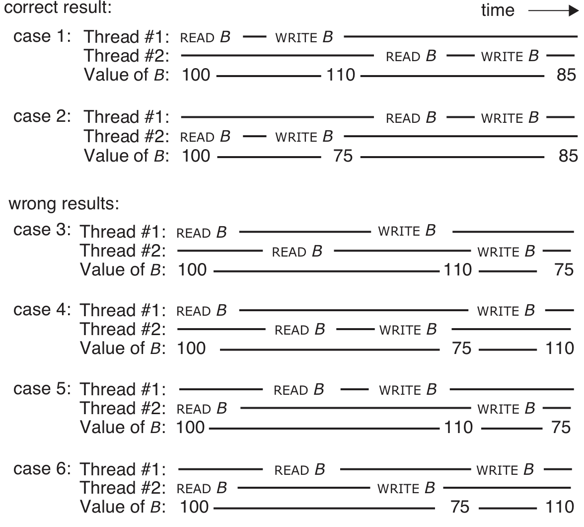
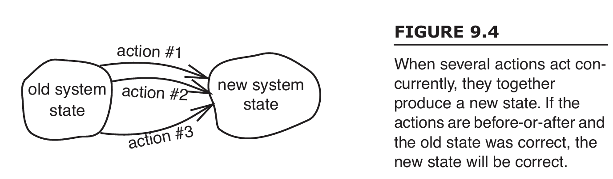
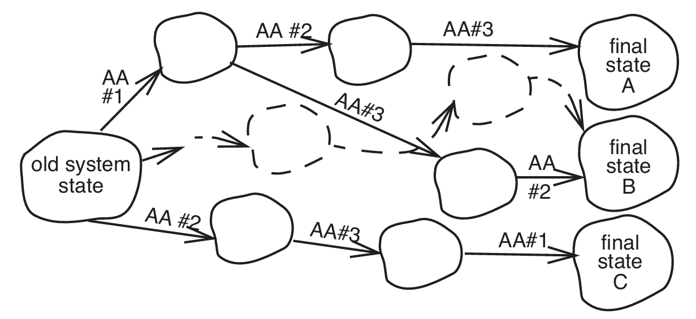
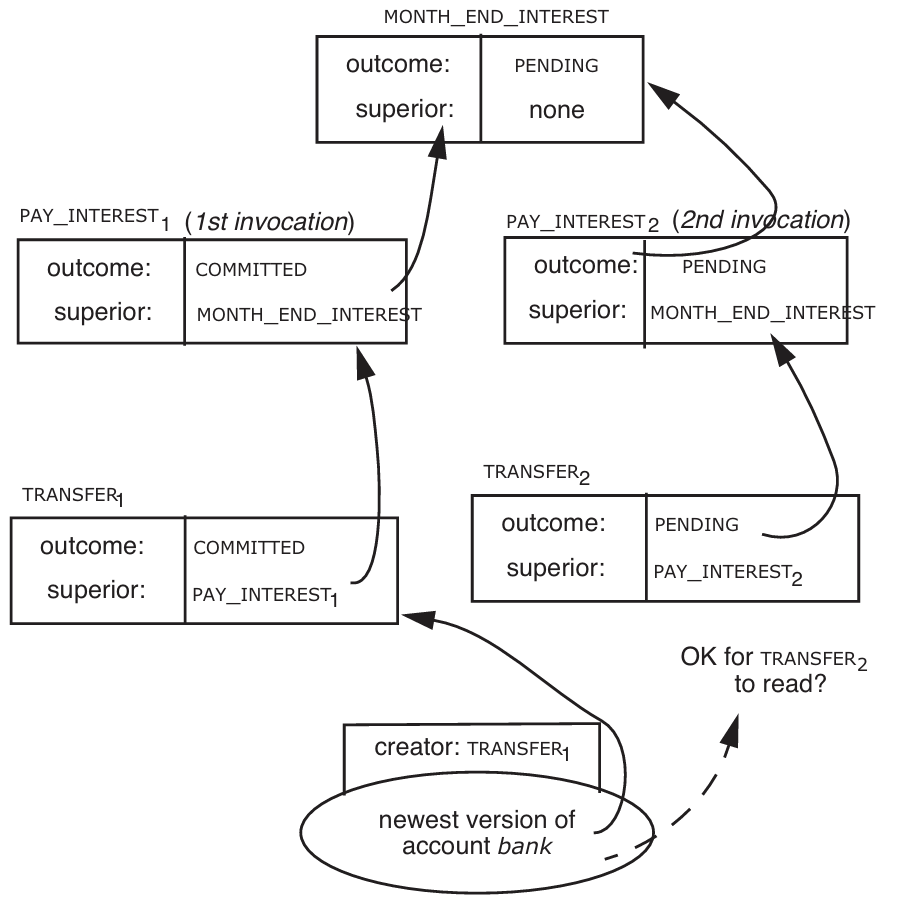
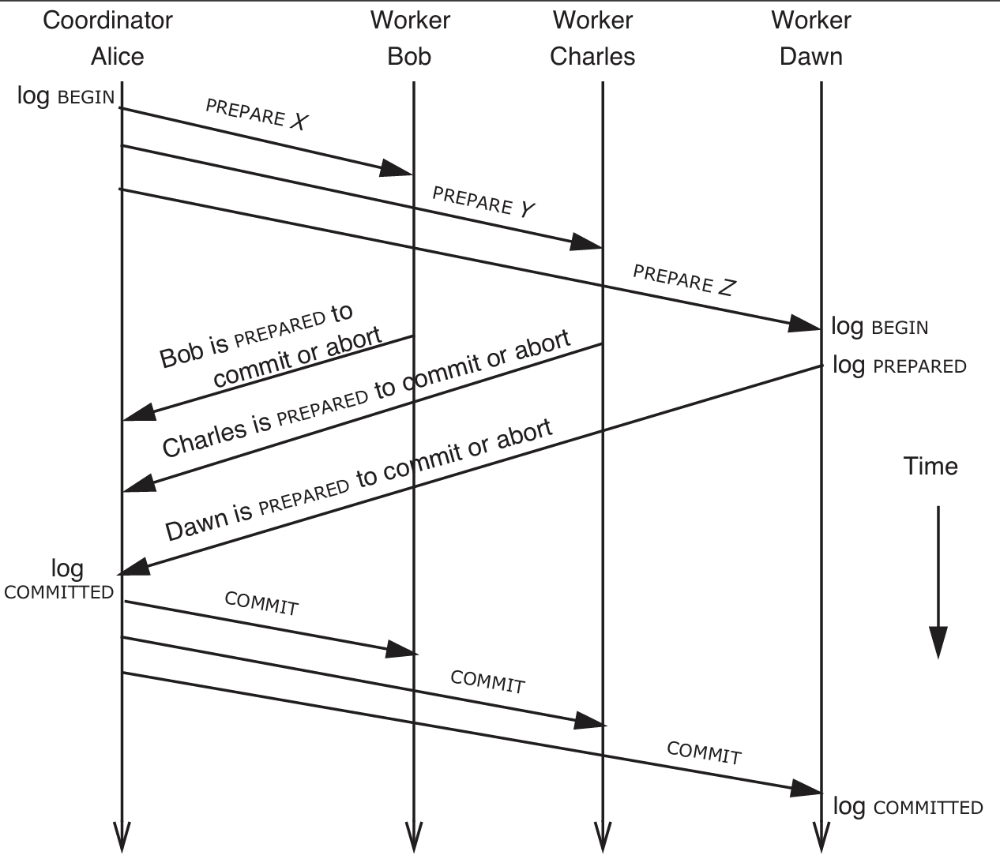

# Chapter-9 

本章介绍了两种原子性保证: `All-or-nothing` 和 `Before-or-after`, [MIT OpenCourseWare](https://eng.libretexts.org/Bookshelves/Computer_Science/Programming_and_Computation_Fundamentals/Principles_of_Computer_System_Design_(Saltzer_and_Kaashoek)/03%3A_Atomicity_-_All-or-nothing_and_Before-or-after)

## 9.1.5

两种并发协调的需求: ***sequence coordination*** 和 ***Before-or-After Atomicity: Coordinating Concurrent Threads***

前者, **序列协调**, 指的是`Action W must happen before action X`, 确保多个操作按一定顺序执行, 来保证数据的一致性, 后者, **前后原子性**, 具有该性质的并发操作在调用者的视角下, 这些操作要么完全先于其他操作, 要么完全在其他操作之后发生, 也就是不能观察到该操作过程中的状态.

书中指出, 二者的一个主要区别是需要具备前后原子性的操作, 并不知道其他可能访问共享数据的操作的身份. 以锁实现的操作为例, 我们只是在进入临界区修改临界数据之前调用**Acquire**, 我们并不知道其他可能等待锁的操作的身份.

```c
void f(int &x, int &y, int num){
  x = x - num;
  y = y + num;
}

int A = 300, B = 100, C = 175;

f(A, B, 10) , f(B, C, 25);
// 我们期望上面两个操作发生后, A=290 B=85 C=200
```

不管这两个操作谁先发生, 都能得到我们期望的结果, 但是如果这两个操作并发的执行, 就有丢失正确性的风险:

对数据B来说, 操作分为了`READ B`和`WRITE B`两步, 如果这两步不能保证是原子性的, 那么就会因为并发执行上述两个操作带来错误的最终结果, 书上给了6种情况, 其中有4种执行顺序带来错误的最终值.



## 9.1.6

`It would be better to have a more general concept of correctness that is independent of the application`, 上图中的前两个执行顺序得到的结果是正确的, 但是正确与否这出自我们对函数`f()`的理解, 这一节我们跳脱出具体的应用, 定义一个所谓的`正确`, 主要缘由是`Application independence is a modularity goal`.

关于**正确性**: `if every result is guaranteed to be one that could have been obtained by some purely serial application`, 也被叫做`linearizability`或者`Atomic Consistency`. 即从系统的外部看, 所有的操作都好像是按照某种特定的顺序串行执行, 尽管实际执行时是并发的.



实际上, 对于前后原子性的操作而言, 我们甚至不必关心其中间的状态, 系统可以沿下图的虚线轨迹穿越中间状态, 即使根据应用程序的定义, 这些中间状态并不是正确的, 但只要这些错误的状态在执行层上不可见, 而且系统保证最终进入一个可接受的最终状态, 我们就可以说协调正确.



9.16小节关于`B`的`READ`和`WRITE`的案例只是一个很小的例子, 它仅有两个并发的事件, 即使如此我们也能看见从6条可能的路径中我们可以允许系统沿前两条路径执行, 最终到达符合应用程序要求的正确的系统.

[编写正确的并发程序的一些建议](https://ocw.mit.edu/courses/res-6-004-principles-of-computer-system-design-an-introduction-spring-2009/pages/online-textbook/)

```
In Sections 9.4 and 9.5 of this chapter we will encounter several programming  disciplines that ensure choice from a subset of the possible orders, all members of which  are guaranteed to be correct but, unfortunately, may not include the correct order that has the highest performance.
```

## (other)9.5.1 ***Locks***

因为错误地使用锁会带来严重的问题, 而这又难以调试, 所以对锁而言, 要实现并发事务的正确协调的方法是遵循三个步骤:

1. 制定锁的策略, `Develop a locking discipline that specifies which locks must be acquired and when.`
2. 证明该策略的并发事务具有**前后性质**(原子性), `Establish a compelling line of reasoning that concurrent transactions that follow the discipline will have the before-or-after property.`
3. 锁管理器, `Interpose a lock manager, a program that enforces the discipline, between the programmer and the ACQUIRE and RELEASE procedures.`

9.5.1~9.5.3分别介绍了三种正确实现了并发事务的正确协调的锁准则.

---

**1: first and simplest lock discipline: system-wide lock**

```c
begin_transaction();
acquire(System.lock);
...
release(System.lock) 
end_transaction() ;
```

简单来说, 每个事务都使用锁, 实际意义上并发的事务在这种方案下其实是严格的序列化, 一次只会执行一个事务, 这显然是粗粒度的策略, 限制了很多并发的可能.


## 9.5.2 ***Simple Locking***

**2: simple locking, like mark-point discipline**

1. `each transaction must acquire a lock for every shared data object it intends to read or write before doing any actual reading and writing.`
2. `it may release its locks only after the transaction installs its last update and commits or completely restores the data and aborts.`

***lock point***: `the first instant at which it has acquired all of its locks`;

***lock set***: `The collection of locks it has acquired when it reaches its lock point`

这个策略细粒度放在了数据上, 每个事务进行写入或读取操作前, 都会获取其打算写入或读取的每个共享数据的对象的锁, 只有在事务中写操作完成并提交后, 才能释放其锁.

证明也比较容易理解, 每个事务将其需要的锁作为参数传入给锁管理器, 只有获得所有的锁后才允许事务进行写入或读取, 在此之前, 需要等待获得所有锁, 在同一时间执行的事务, 其`lock set`绝不会有交集, 那么很容易发现这样的事务具有前后性质.

但是即使是这样的策略, 也会有减少很多并发的可能性的缺陷, 考虑下面一个事务的代码:

```c
void f(int obj1, int obj2, int obj3) {
  acquire(obj1.lock, obj2.lock, obj3.lock)
  if(obj1 > 0) {
    printf("%d\n", obj2);
  } else {
    printf("%d\n", obj3);
  }
  release(obj1.lock, obj2.lock, obj3.lock)
}
```

显然, 我们别无选择, 在`simple locking`下, 只能锁定`obj1`, `obj2`, `obj3`三个数据, 即使我们不会全部读取或写入.

## 9.5.3 ***Two-Phase Locking***

**3: two-phase locking, like the read-capture discipline**

两阶段锁事务进行时获取锁, 唯一的要求是在事务到达其锁定点前不能释放锁, 之后不能获取锁, 也就是说, 获取锁的数量在锁定点之前称为**the first phase**, 在锁定点之后称为**the second phase**.

两阶段锁显然比前面两种策略更灵活,  这种策略下的程序并发性也更好, 不过尽管如此, 也还是会有一些阻碍并发的缺陷, 考虑事务$T_{1}$包含`READ X`, `WRITE Y`, 事务$T_{2}$包含`WRITE Y`, 显然我们可以发现, 如果是并发执行:

```
T1: READ X 
T2: WRITE Y 
T1: WRITE Y
```

其结果和两个事务按前后原子性执行也是一样的, 不过我们不用对并发性太苛刻, 毕竟设计出同时确保前后原子性和最大并发性的策略被认为是**NP完全问题**.

---

让我们来考虑锁和日志的交互, 有两个情况需要我们思考

1. 中止的单个事务
2. 系统恢复

中止的事务只需要将释放锁之前将修改的数据恢复即可.

对于系统恢复, 问题是锁本身也是系统的资源,是否需要视为记录更改的数据对象, 对此的回答是不必, 我们使用锁来协调并发的事务, 最终得到的是一个数据操作的特定序列, 在把这些序列化的事务记录到日志中时, 就已经完成了其任务了, 只要在系统恢复结束前不开始性的事务, 就能保证按正确的序列执行事务, 当然这里也可以做一些优化, 比如允许开始新的事务, 但是使用cow等技术.

## (other)9.6 ***Atomicity across Layers and Multiple Sites***

现今为止, 我了解到的原子性存在一些`gaps`还未涉足: 

- 分层系统的原子性事务
- 多站点的原子性事务, 构成事务的符合操作都在近距离内完成, 没有考虑过组成的操作在物理上分离, 通信延迟, 可靠性, 独立故障会使原子性变得更难以实现

---

分层的系统中, 某一层事务的行为, 可能由更低层实现的, 本身是原子性的组件行为组成, 简短来说, **较高层的原子操作本身可以拆解为更底层的若干个原子操作**.  `If the higher-layer transaction decides to abort, the question is what to do about lower-layer transactions that may have already committed.` 有两个可能的解决方案: 

1. `UNDO action`, 也就是取消已提交的较低层事务, 不过这需要较低层的事务结果对本层内部可见
2. 延迟较低层的事务提交, 使其与较高层的事务同时提交

---

二者的一个共同子问题: **implementing nested transactions 实现嵌套事务**, 我们先逐步解决该共同问题, 然后扩展该问题的解决方案, 得到 ***two-phase commit*** 协议, 然后使用一种特殊的*RPC*扩展两阶段提交协议, 来协调在上述`gaps`第二点的并发事务---**multiple-site transaction**, 即多站点事务. (ps: 多站点事务与两个将军的困境很相似)

## (other)9.6.1 ***Hierarchical Composition of Transactions***

```c
// procedure
// 根据账户余额实现对每个账户的支付或提取利息
void PAY_INTEREST(Account &account) {
  if account.balance > 0 {  
    double interest = account.balance * 0.05;
    TRANSFER(bank, account, interest);
  } else{ 
    double interest = account.balance * 0.15; 
    TRANSFER(account, bank, interest);
  }
}

// procedure
// 银行遍历每个账户, 调用PAY_INTEREST
void MONTH_END_INTEREST(){
  for A in customer_account{
    PAY_INTEREST(A);
  }
}
```

银行运行`MONTH_END_INTEREST()`的同时, 其他正在进行的程序也会调用`TRANSFER()`, 实际这里有三层事务:

1. 第三层, 最低层, 应该保证`TRANSFER()`, 账户的借记和贷记必须是原子操作;
2. 第二层, `PAY_INTEREST()`操作应该原子地执行, 该操作调用了`TRANSFER()`
3. 第一层, `MONTH_END_INTEREST()`被视为是一次原子事务, 避免在结算的时候由于其他正在并发执行的`TRANSFER()`修改这些账户的数据导致错误结算.

对于调用链:`PAY_INTEREST()`->`TRANSFER()`, 该嵌套调用的提交点必须在同一时刻, 如果`TRANSFER()`先提交, 那么在`PAY_INTEREST()`提交之前的这段时间如果系统崩溃, 将无法回滚已经修改的账户数据;  如果`TRANSFER()`后提交, 那么`PAY_INTEREST()`操作本身不符合要求, 因为一旦事务提交, 那么就应该保证所有操作都成功完成, 但是`TRANSFER()`可能会因为某些原因无法完成, 违反该原则.

而对`MONTH_END_INTEREST()`而言, 带来了新的协调问题, 在其运行的时候, 其他事务不应该进行`TRANSFER()`操作, 但是其本身需要进行多次`TRANSFER()`.

假设系统为事务提供了版本号机制: `we allow outcome records to be organized hierarchically`, 通过为每个事务记录下面三个信息, 我们可以在日志记录中蕴含事务嵌套的逻辑结构.

1. 版本号
2. 为每个事务的`outcome(输出结果)`设置`PENDING`, `COMMITTED`, `tentatively COMMITTED`, `ABORTED`4种状态
3. 增加`superior`标识符, 记录更高层次的事务, `none`表示当前已是最高层事务

对于一个事务的结果, 当且仅当其所有祖父事务全部`COMMITTED`, 才称其为`COMMITTED`, 也就是说, 一个看似提交的结果, 首先是`tentatively COMMITTED`, 当确认其所有依赖项事务提交后, 才能说其提交了.

嵌套事务这种层次性的日志安排实际中有很多复杂性, 这里不过多地去介绍, 可以思考嵌套事务中不同事务的交互, 这里是一个例子:



## (other)9.6.2 ***Two-Phase Commit***

我们可以将一个分层事务的提交描述为两个不同的阶段, 故得名**Two-Phase Commit**.

**第一阶段**也叫做`preparation phase(准备阶段)`或者`voting  phase(投票阶段)`, 这个阶段更高层的事务调用更低层的事务, 这些低层的事务要么中止(`ABORTED`), 要么提交变得暂时提交(`tentatively COMMITTED`), 顶层事务会收集这些事务状态, 直到确定所有或足够多的底层事务变得暂时提交, 以便进入下一阶段;

**第二阶段**, 即`commitment phase(提交阶段)`, 根据上一阶段收集的事务提交情况, 决定将更高层事务从`PENDING`修改为`COMMITTED`或`ABORTED`, 然后通知这些更低层的事务, 将状态修改为`COMMITTED`或`ABORTED`, 如果该"更高层"本身也在嵌套在上一层事务中, 那么其组成事务包括自身继续处于`tentatively COMMITTED`状态.

将事务分层嵌套的概念本身就很有用, 为了构建多站点事务的原子性, 我们接下来探讨什么使得多站点事务不同于单站点事务.

## 9.6.3

如果一个事务由多个`best-effort network`分割的站点的事务组成, 那么为其提供原子性保证则变得异常困难: 丢失, 延迟, 重复. 在以前的学习中, 我们知道了*RPC*, 使用`persistent sender`来确保至少执行一次, 使用`duplicate suppression`确保至多执行一次, 不过这不足以提供多站点事务的原子性保证.

1. 2PC协议
2. *persistent sender*
3. *duplicate suppression*
4. 单站点事务

通过以上服务, 我们足以创建一个正确的多站点事务.

假设每单个站点本地事务具有上述*all-or-nothing*和*before-or-after*原子性; 如果所有站点的事务都提交或中止, 那么多站点事务原子性协议是正确的, 如果某些站点提交, 某些站点中止, 那么我们说该协议不正确. 设想一个多站点事务, 有一个`coordinator Alice`, 执行一个事务, 由`X`, `Y`, `Z`组成, 这些低层事务由`workers`, `Bob`, `Charles`和`Dawn`提供, 简单的几次rpc消息肯定不足以使`Alice`组合各站点事务形成一个原子性的多站点事务, 我们需要更多的细节.

一个多站点事务, 我们可以视为一个分层事务, 其中`Alice`这样的协调者服务器创建了一个高层事务, `Bob`这样的*worker*服务器作为底层事务的创建与执行方, 在前面我们了解到了分层事务的原子性保证是通过2PC: 两阶段提交协议实现的, 所以对于多站点事务, 我们需要的是一个**分布式版本的两阶段提交协议**, 问题是分布式系统中的服务器与服务器不能可靠地通信, 那么问题就再次简化为了构建一个可靠的分布式版两阶段提交协议, 这我们可以通过*persistent sender*和*duplicate suppression*实现.

1. *Alice*创建一个高层事务, 分配编号271
2. (`初始化顶层事务`)  *Alice*并行发送rpc给三个*workers*服务器, 告诉其自己创建的事务, 并通知这些服务器创建并执行底层事务`X`, `Y`, `Z`
3. (`初始化子事务`)  *Bob*, *Charles*, *Dawn*收到来自*Alice*的消息后, 创建271号事务嵌套下的底层事务, 然后进行`pre-commit`部分的, 并发rpc告诉*Alice*该底层事务已准备提交
4. (`2pc msg#1: 准备消息`)  当*Alice*收到所有(或者足够)的"可以提交"的rpc后, 再次并行发送`Two-phase-commit message #1`消息给这些服务器, 通知其进行事务的第二个阶段
5. (`2pc msg#2: 响应准备消息`)  这些*worker*服务器收到消息后, 暂时提交/中止这些嵌套事务中的底层事务, 此时这些底层事务的状态要么是`PREPARED`要么是`ABORTED`, 同样的, 发送`Two-phase-commit message #2`回复*Alice*这些事务的状态, 此时这些负责底层事务的服务器陷入准备状态, 等待协调者*Alice*通知他们提交或者放弃该事务
6. (`2pc msg#3: 提交消息`)  *Alice*等待接受齐所有*workers*的响应, 如果所有人都说`PREPARED to commit`, 那么2PC第一阶段就结束了, 如果某些服务器回复`ABORTED`, 那么协调者会选择中止此次事务, 或者稍等一下, 把收到`ABORTED`的子事务发给另一个*worker*来尝试执行,  总之最终会进入2PC的第二个阶段, *Alice*标记自己的事务为`COMMITTED`或`ABORTED`, 然后并行发送`Two-phase-commit message #3`给其他服务器
7. 每个工作站点(*worker*服务器)收到`Two-phase-commit message`消息后将自己负责的子事务从`pre-commit`修改为`COMMITTED`或者说`ABORTED`, 执行需要的`post-commit`操作.

上述的所有rpc消息都采取了*persistent sender*和*duplicate suppression*确保幂等, 因此协调者需要记录自己提交的事务, 以便处理重复的`Two-phase-commit message #2`消息, 避免其他站点陷入长久的等待.



---

### 谈一谈不同的分布式2pc变种

***1, 减少rpc数量***

图示展示了上面描述的一个协调者和三个工作站点的一次事务过程, 可以看到, N个工作站点完成2pc的rpc数量最少为3N(不考虑超时重发等网络故障导致的额外rpc), 我们可以简化一些, 将`初始化顶层事务`和`初始化子事`务附加到`准备消息`和`响应准备消息`中, 不过这样做存在一些缺陷, 书中指出, 工作站点响应准备消息后会陷入等待, 为了提供系统的并发性和吞吐量, 我们需要最小化工作站点的等待时间, 通常才会延迟发送`准备消息`和`响应准备消息`.

设想一下, 工作站点可以在收到`初始化顶层事务`后就开始初始化子事务并可以开始执行一些内容, 然后在收到`准备消息`前去做其他事情, 等到协调者收到了足够的`初始化子事务`响应后发送`准备消息`, 这个阶段下的工作站点其实执行了自己负责的子事务, 立刻就能够返回`响应准备消息`. 

而如果我们将`初始化顶层事务`和`准备消息`绑定在一起, 那么每个工作站点在收到该绑定消息后, 需要初始化并执行自己的子事务然后陷入等待, 这样的缺陷第一是**工作站点必须陷入等待, 不得去做其他的事情**, 第二是**所有站点共同承担了某些服务器因故带来的延迟**.

简单来看一个例子就是, 站点`Bob`收到`Alice`的指示, 初始化了自己的子事务`X`并响应, 然后就可以开始做`X`的内容, 其可能涉及到*IO*操作, 等到`Alice`发`准备消息`的时候, `Bob`或许已经执行完`X`, 只是在等`准备消息`, 那么就可以立即响应其. 所以这就是为什么我们一般把`初始化顶层事务`/`初始化子事务`与`准备消息`/`响应准备消息`分隔开, 后者延迟发送的原因.

更远的来看, 这两个方式是对**单轮多站点事务**

***2, 减小协调者保存的信息***

这一点比较容易想到, 前面提到协调者为了回复某些过时的`2pc msg#2: 响应准备消息`rpc, 需要记录自己提交的事务, 而如果我们额外添加一组用于确认的rpc, 当协调者发现所有的*workers*都确认后, 就可以安全地丢掉该事务记录.

或者说也可以在协调者服务器中为每一轮事务添加一些标记, 累计已回应不同服务器的`2pc msg#2: 响应准备消息`数量, 全部确认后就可以丢弃该事务记录, 不过需要在该`2pc msg#2`rpc中包含发送方服务器的标识符.


***3, presumed commit***

出于对实际事务的观察"大多数事务都会提交", 我们可以通过丢弃已提交的事务信息, 转而保存被中止的事务信息, 即当收到不存在的事务记录查询, 我们回应其`COMMITTED`.

### 谈一谈故障恢复

不管是协调者还是工作站点服务器, 是否有*abort*事务的权利, 取决于是否有站点已经提交子事务并释放了锁, 在这之前我们都可以给服务器*abort*事务的权利, 但是在这之后, 因为我们没有说让这个已提交事务回滚的策略, 所以必须要继续事务. 